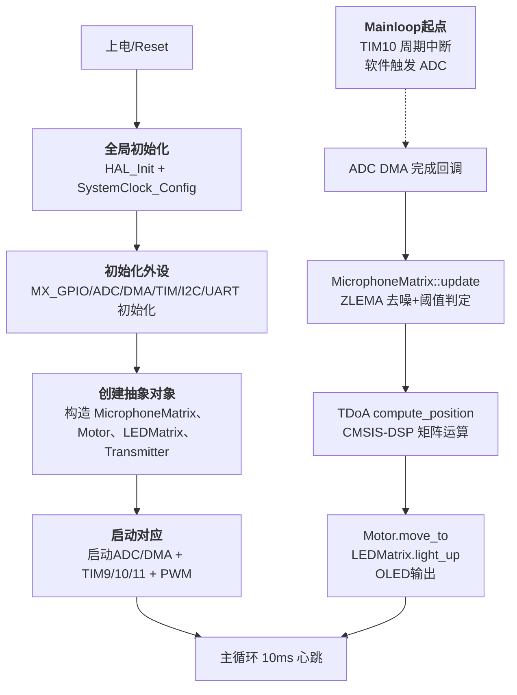
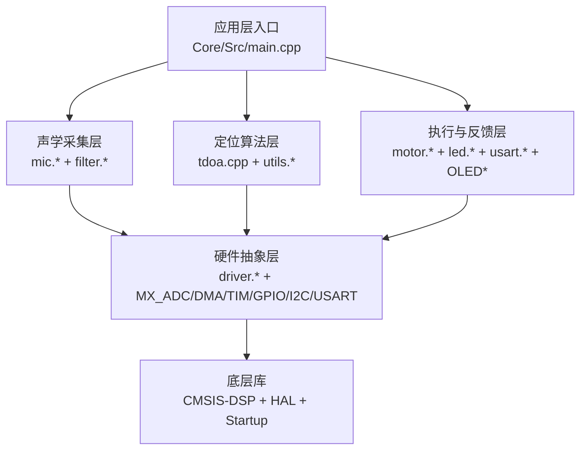
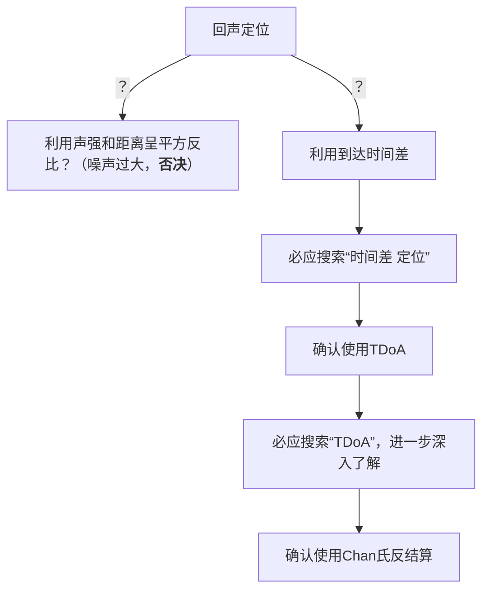
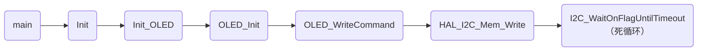
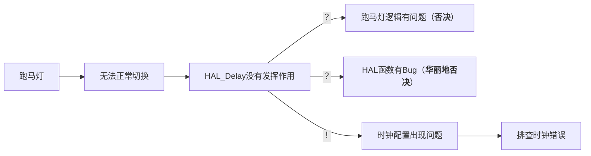
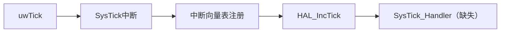

# 摘要
## 功能定位
通过4个麦克风阵列采集声源，到达时间差 (TDoA) 解算空间位置，并驱动电机、LED环、OLED完成反馈。

## 主要特性
- DMA连续采样
- 基于中断触发的流程
- 硬件加速（基于CMSIS-DSP）的矩阵运算
- 高性能滤波器降噪
- PID电机控制

## 模块组织结构

## 完成度自评
软件总体完成度良好，但是由于时间限制，没能实现GCC算法（GCC-ML）来进一步提高相位差计算时的精度

---

# 软件设计
## 核心模块说明
### 主控与系统初始化
- `Core/Src/main.cpp` 负责系统启动、全局对象创建以及外设初始化。
- 注册 `HAL_ADC_ConvCpltCallback` 处理完整 DMA 周期：读取 ADC 缓冲、更新麦克风状态、调用 TDOA 求解、触发电机与可视化输出。
- 定时器职责：TIM10软件触发ADC、TIM11预留给PID调度、TIM9读取编码器。

### 声源采集与预处理
- `mic.hpp/cpp` 管理4通道ADC缓冲，结合 `ZLEMAFilter` 去噪并根据阈值窗口筛选有效波形，支持 Single/Random/Measure/Continuous 模式切换和趋势判定。
- `filter.hpp/cpp` 提供环形缓冲、ZLEMA、标量Kalman滤波器，用于降噪和迟滞补偿。
- DMA (`Core/Src/dma.cpp`, `adc.cpp`) 以扫描模式采样4路模拟输入，减少CPU干预。

### 执行与反馈
- `motor.hpp/cpp` 封装TB6612电机驱动，结合编码器反馈与PID控制角度，支持向目标角度运动与PWM控制。
- `led.hpp/cpp` 控制LED环扇区点亮，映射到8段显示。
- `OLED.c/h` 与 `I2CPort` 结合在I2C上发送命令和数据，为测距/状态输出提供文本界面。
- `usart.hpp/cpp` 封装UART6发送，`Transmitter::send` 用于获取麦克风的原始输出，计算电气特性并估算卡尔曼滤波的协方差矩阵等先验数据

### 底层驱动与封装
- `driver.hpp/cpp` 对 GPIO、定时器等 HAL 句柄进行轻量 C++ 封装，增强类型安全与可读性。
- `tim.cpp`, `gpio.cpp`, `i2c.cpp`, `usart.cpp`, `stm32f4xx_it.cpp` 等由 CubeMX 生成，负责具体外设初始化、中断向量与 MSP 配置。
- `attached_lib/`, `Startup/` 以及 `Drivers/` 是来自江协科技的OLED驱动库

# 算法
## TDOA 定位算法

主要参考资料：https://www.bing.com/search?pc=MOZI&form=MOZLBR&q=%E6%97%B6%E9%97%B4%E5%B7%AE+%E5%AE%9A%E4%BD%8D

### 概述
- `tdoa.cpp` 基于Chan解算的二维定位流程，使用`utils.cpp`中的矩阵封装与 CMSIS-DSP（`arm_mat_*`，`arm_sqrt_f32`等）完成代数运算，输出声源平面坐标。
- `utils.hpp/cpp` 统一矩阵操作、向量封装以及朴素距离求解等工具函数。
- 使用了`std::optional<T>`等来处理除零的问题。我承认有点Rust的惯性在里面

### 历程

## PID算法
### 概述
PID算法的实现在`Motor::poll()`中。作为最著名的控制算法之一，PID的伟大毋须多言，必须给到夯。我选用的是离散化的版本

$$
\text{Output} = K_p \cdot e(k) + K_i \cdot\displaystyle\sum_{i = 0}^{k}{e(i)\Delta t} + K_d \cdot \dfrac{e(k) - e(k-1)}{\Delta t}
$$

同时在软件层面对积分项的上限做了限制，防止在连续追踪的过程中出现积分项值过大的情况

---

# 困难与挑战
## 底层细节
### 描述
STM32的开发会涉及到非常多底层的细节，在编写外设代码的时候会带来很重的心智负担

### 解决方案
用面向对象的思路，构建出外设的鸭子对象。减轻调用时的心智负担，降低出错风险

---

## 滤波器
### 描述
卡尔曼滤波器非常困难，原理难以理解

### 解决方案
利用Gemini辅助学习卡尔曼滤波的思想，了解运行原理。并独立写出标量线性卡尔曼滤波的实现

---

## 初始化时钟（Debug）
### 错误（1）
**描述**：I2C无法正常通过硬件传输数据
**错误堆栈**

### 错误（2）
**描述**：LED可以点亮，但是不能跑马灯
**推理逻辑**

在排查时钟错误的时候，使用了ChatGPT了解STM32中HAL_Delay更底层的工作原理，了解到下面的依赖链条：

经过排查，确认遗失`SysTick_Handler()`以及后续全部调用链，导致所有依赖于`uwTick`的HAL函数失效

### 解决方案
利用CubeMX重构项目，解决了时钟和其它基础设施初始化问题

---

## CMSIS-DSP不可用
### 描述
做native单元测试的时候发现我的计算机（x86-64）不能使用CMSIS-DSP（ARM）库

### 解决方案
使用C标准库在x86-64下重写使用到的CMSIS-DSP库函数，并保持接口一致

# 趣事一则
我面对的并非总是技术问题，有时候还要处理和别的小组的关系。我同学的组员向我求助电机的控制算法、TDoA算法和滤波器算法。我不得不在“帮”和“不帮”之间作出选择。不过考虑到我们首先是将要同窗四年的同学，其次才是在这场比赛中的竞争对手，为了一时的利益而放弃同学情谊，多少有些得不偿失。所以我无偿、无保留地向他提供了全部的电机控制算法实现、各种IIR滤波器及其变体的实现（虽然是Rust的）以及Chan反解算的指导。PS，其实当时也有一个原因——我相信哪怕向他们提供了帮助，我们组依旧有足够的竞争力，也算是对小组自身实力的一种认同和自信吧

