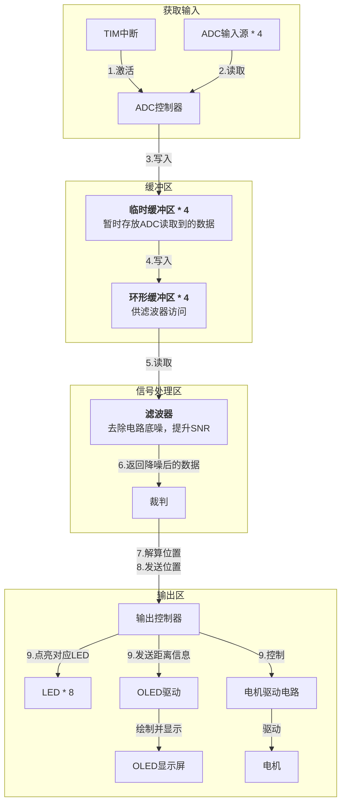

上面就是软件层面工作的流程图了

## 引脚占用

### SSD1306

需要一个I2C_SCL一个I2C_SCA。检查了一下DataSheet，AI是对的，所以占用下面几个引脚：

PB6: I2C1_SCL
PB7: I2C1_SCA

### 74HC138

只占用三个引脚，负责输出数据：
PA8、PA9、PA10

### MAX9814

必须占用ADC引脚，四个OUT选定为:

PA0
PA1
PA2
PA4

### TB6612

AIN1: PB0
AIN2: PB1
PWMA: PA3
